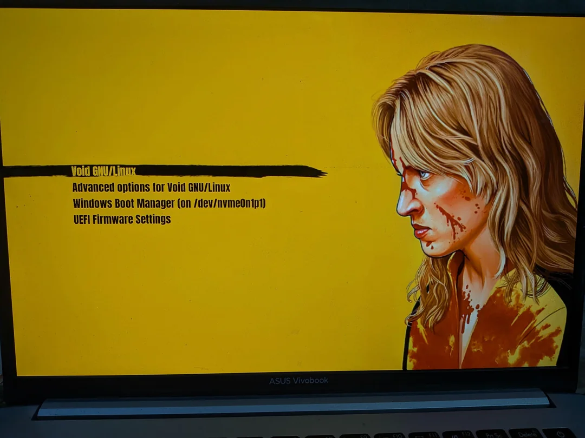

# Kill-Bill-GRUB

A sleek, custom GRUB bootloader theme inspired by *Kill Bill*.

---

## 📸 Preview

---

## 🚀 Installation

### 1. Clone or Download the Repository

    git clone https://github.com/GogoMan23/Kill-Bill-GRUB.git
    cd Kill-Bill-GRUB

### 2. Copy Theme to `/boot/grub/themes/`

Create the themes directory if it doesn't exist and copy the theme folder over:

    sudo mkdir -p /boot/grub/themes
    sudo cp -r . /boot/grub/themes/Kill-Bill-GRUB

---

## ⚙️ Configuration

### 3. Edit your GRUB Configuration

Open `/etc/default/grub` in your text editor:

    sudo nano /etc/default/grub

Add or update the `GRUB_THEME` line to point to `theme.txt`:

    GRUB_THEME="/boot/grub/themes/Kill-Bill-GRUB/theme.txt"

*(Optional)* Set your native screen resolution:

    GRUB_GFXMODE="1920x1080"

---

## 🔄 Apply Changes

Update your GRUB bootloader configuration:

* **Fedora / RHEL:**
    sudo grub2-mkconfig -o /boot/grub2/grub.cfg

* **Arch Linux / Void:**
    sudo grub-mkconfig -o /boot/grub/grub.cfg

  
* **Debian / Ubuntu:**
    sudo update-grub  

---

## 🗑️ Uninstallation

To remove the theme:

1. Open `/etc/default/grub` and remove or comment out (`#`) the `GRUB_THEME` line.
2. Regenerate GRUB configuration.
3. Delete the theme directory:
    sudo rm -rf /boot/grub/themes/Kill-Bill-GRUB

---

## 📝 License

Distributed under the MIT License.  

---

## 💳 Credits & Acknowledgements

* **Creator:** [@GogoMan23](https://github.com/GogoMan23)
* **Inspiration:** Inspired by Quentin Tarantino's *Kill Bill* and [sekiro-grub-theme]https://github.com/AbijithBalaji/sekiro_grub_theme
